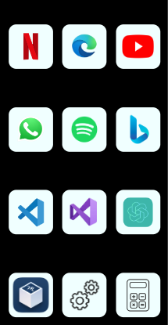

# Controle remoto para computador
### Abra 12 apps diferentes no seu computador a partir do celular



## Instalação
faça a instalação a partir do `git clone`:
```
  git clone <url do repositório>
```

## Como usar
Execute o arquivo `root.py` e aguarde a página web Flask abrir:
```
  python root.py
``` 
```
  * Serving Flask app 'root'
  * Debug mode: on
  WARNING: This is a development server. Do not use it in a production deployment. Use a production WSGI server instead.
  * Running on all addresses (0.0.0.0)
  * Running on http://127.0.0.1:5000
  * Running on http://192.168.0.11:5000
  Press CTRL+C to quit
  * Restarting with stat
  * Debugger is active!
  * Debugger PIN: 573-136-984
```

Quando o servidor Flask estiver levantado, abra a página web pelo celular com o segundo link dsponível. Agora só clicar no ícone do app que você deseja abrir. <br> <BR>
`LEMBRE-SE DE TER EM SEU COMPUTADOR, TODOS OS APPS QUE ESTÃO LISTADOS A SEGUIR:`
```
  - Microsoft Edge
  - WhatsApp
  - Spotify
  - Visual Studio Code
  - Visual Studio 2022
  - Oracle VM VirtualBox
```
